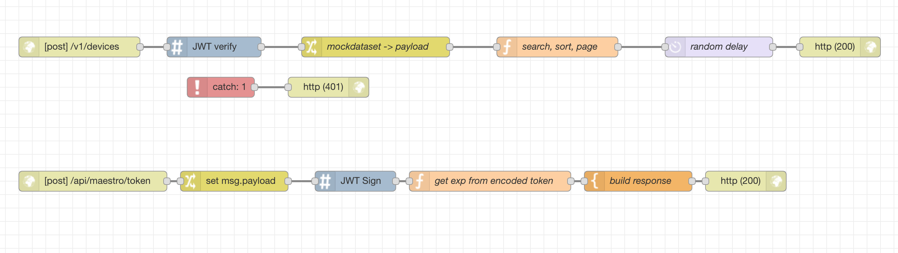

# Node-Red

- Flow Based Visual Programming Tool
- Built on Node.js
- Run by the Linux Foundation



# Docker-Compose

- cli tool for running multi-container applications
- YAML Based
- Offers everything you'd find in the `docker run` command, and some things from `docker build`

```
version: '3'
 
services:

  red:
    image: nodered/node-red-docker:0.19.5-slim
    volumes:
      - ./node-red:/data
    ports:
      - 1880:1880


  mqtt:
    image: eclipse-mosquitto
    ports: 
      - 1883:1883
      - 9001:9001
```
<!-- 
# Server Duct tape

## Node-Red
- Sticking sensors to timeseries databases
- Sticking uis to mqtt
- Mock backends for UI

## Docker-Compose
Sticking SSL to anything -->


# Things I've Used It For:

## Hobby Stuff:

- [Running my heater](../static/esp-switchy.jpg)
- [Turning on my tunes](../static/Redfish-Dashboard.png)
- [Tracking my office temperature](../static/Redfish-Dashboard.png)
- [Tracking the family budget](../static/Redfish-Dashboard.png)
- Alerting on events to my phone
    - peak temperature

## Side Hustle Stuff:

### Dureddo Water monitoring
- [Graphing ultrasonic sensors in remote locations](../static/dureddo-grafana-dash.png)
- Alerting on change

## Solarwinds Stuff:

### Netpath Util Server
- A swiss army knife for solving basic test problems
    - [Mock maestro with randomized latency](../static/maestro-flow.png)
    - Alerting capture and replay
    - Easy non-secure jwt token signing for QA


# Node Red Demo

* Settings File
    - flow files
    - authentication methods
* Basic Flow Bits & Debugging
* Http / Rest from Scratch
* MQTT+Influx+Chart flow
* Custom Modules


urls:


https://github.com/aaronpropst/red-rapid-proto

Util Server
https://ncint-util.hogs.swmsp.io/admin/#flow/78b411a.8d424f


